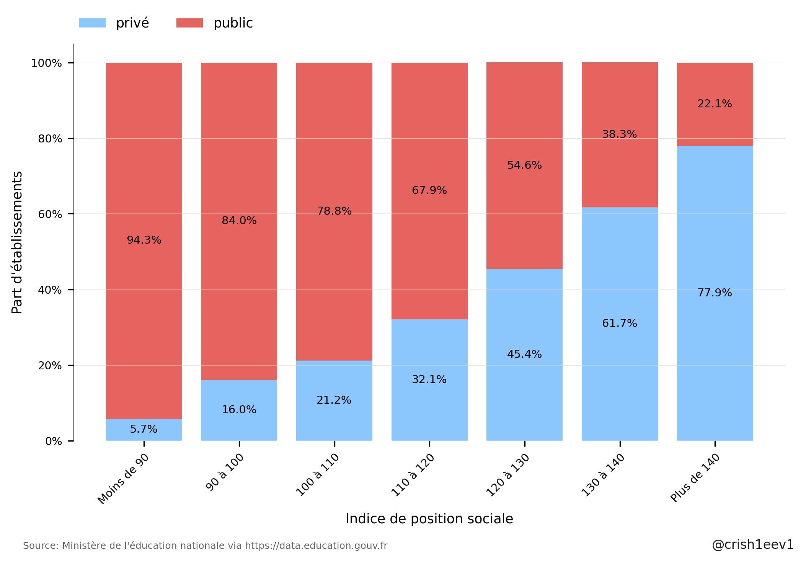
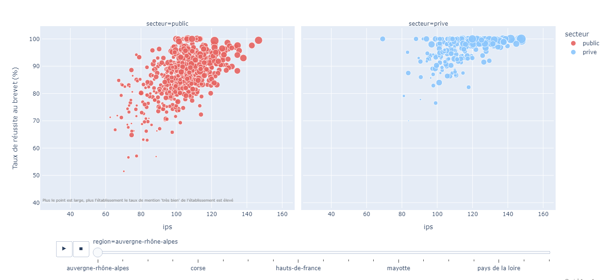

 Click <a href="https://crish1eev1.github.io/report.html" target=“_blank”>here</a> to access the html version of this report

# Etude de la mixité sociale entre public et privé dans les établissements scolaires français

## Sources utilisées

<table>
    <tr>
        <th>
TITRE
</th>
        <th>
SOURCE
</th>
        <th>
LIEN
</th>
        <th>
MAJ
</th>
    <tr>
    <tr>
        <td>
Indices de position sociale dans les collèges de France métropolitaine et DROM  
        
</td>
        <td>
data.education.gouv.fr
</td>
        <td>
<a href="https://data.education.gouv.fr/explore/dataset/fr-en-ips_colleges/table/?disjunctive.rentree_scolaire&disjunctive.academie&disjunctive.code_du_departement&disjunctive.departement&disjunctive.uai&disjunctive.code_insee_de_la_commune&disjunctive.nom_de_la_commune&disjunctive.secteur", target="_blank">Indices de position sociale dans les collèges de France métropolitaine et DROM</a>
</td>
        <td>
October, 2022
</td>
    </tr>
    <tr>
        <td>
Indices de position sociale dans les écoles de France métropolitaine et DROM 
        
</td>
        <td>
data.education.gouv.fr
</td>
        <td>
<a href="https://data.education.gouv.fr/explore/dataset/fr-en-ips_ecoles/information/?disjunctive.academie&disjunctive.code_du_departement&disjunctive.departement&disjunctive.uai&disjunctive.code_insee_de_la_commune&disjunctive.nom_de_la_commune&disjunctive.secteur", target="_blank">Indices de position sociale dans les écoles de France métropolitaine et DROM</a>
</td>
        <td>
October, 2022
</td>
    </tr>
    <tr>
        <td>
Adresse et géolocalisation des établissements d'enseignement du premier et second degrés  
        
</td>
        <td>
data.education.gouv.fr
</td>
        <td>
<a href="https://data.education.gouv.fr/explore/dataset/fr-en-adresse-et-geolocalisation-etablissements-premier-et-second-degre/table/?disjunctive.nature_uai&disjunctive.nature_uai_libe&disjunctive.code_departement&disjunctive.code_region&disjunctive.code_academie&disjunctive.secteur_prive_code_type_contrat&disjunctive.secteur_prive_libelle_type_contrat&disjunctive.code_ministere&disjunctive.libelle_ministere", target="_blank">Adresse et géolocalisation des établissements d'enseignement du premier et second degrés </a>
</td>
        <td>
October, 2022
</td>
    </tr>
    <tr>
        <td>
Typologie des communes (urbain / rural)  
        
</td>
        <td>
observatoire-des-territoires.gouv.fr
</td>
        <td>
<a href="https://www.observatoire-des-territoires.gouv.fr/typologie-urbain-rural", target="_blank">Typologie des communues (urbain / rural) </a>
</td>
        <td>
2021
</td>
    </tr>
    <tr>
        <td>
Diplôme national du brevet par établissement 
        
</td>
        <td>
data.education.gouv.fr
</td>
        <td>
<a href="https://data.education.gouv.fr/explore/dataset/fr-en-dnb-par-etablissement/information/?disjunctive.session&disjunctive.numero_d_etablissement&disjunctive.denomination_principale&disjunctive.secteur_d_enseignement&disjunctive.commune_et_arrondissement&disjunctive.commune_et_arrondissement_lib_l&disjunctive.departement&disjunctive.departement_libelle&disjunctive.academie&disjunctive.academie_libelle&disjunctive.region&disjunctive.region_libelle", target="_blank">Diplôme national du brevet par établissement</a>
</td>
        <td>
June, 2022
</td>
    </tr>
</table>   

Le code permettant l'analyse de données ci-dessous est disponible sur github:
- <a href="https://github.com/crish1eev1/public-private-distribution-french-schools/blob/main/data-processing.ipynb" target=“_blank”>Collecte et structuration des données</a>
- <a href="https://github.com/crish1eev1/public-private-distribution-french-schools/blob/main/data-analysis_ips.ipynb" target=“_blank”>Analyse et visualisation des données liées à l'Indice de Position Sociale</a>
- <a href="https://github.com/crish1eev1/public-private-distribution-french-schools/blob/main/data-analysis_dnb.ipynb" target=“_blank”>Analyse et visualisation des données liées aux résultats du brevet</a>
  

## Etude de la répartition public/privé des écoles françaises selon l'Indice de Position Sociale (IPS) pour l'année scolaire 2021-2022
### Définition de l'Indice de Position Sociale (wikipedia)
>L'indice de position sociale des élèves (IPS) est un outil de mesure quantitatif de la situation sociale des élèves face aux apprentissages dans les établissements scolaires français. **Plus l'indice est élevé, plus l'élève évolue dans un contexte familial favorable aux apprentissages. Cet indice est construit à partir des professions et catégories socioprofessionnelles (PCS) des représentants légaux des élèves**. 
>Il est utilisé pour décrire les populations scolaires (milieu social plus ou moins favorable et mixité sociale) dans les écoles, collèges et lycées mais aussi pour classer les établissements scolaires et leur attribuer des moyens en conséquence. 
L'indice de position sociale (IPS) des élèves est un indice sans dimension compris entre 38 et 1791. Plus cet indice est élevé, plus le contexte familial de l'élève est favorable à sa réussite scolaire. 

Note: les jeux de données fournissent un IPS par établissement pour les écoles et les collèges. Les graphiques et tableaux figurant dans la section 1 de ce document sont établis par établissement scolaire, sans pondération par le nombre d'élèves scolarisés dans chaque établissement.
  

### Distribution des écoles et collèges public/privé de France selon IPS

  

|                    |   Nombre      |  IPS moyen |  Ecart-type |   Valeur minimum       |   Valeur Maximum       |   Mediane   |
|--------------------|---------------|------------|-------------|------------------------|------------------------|-------------|
| Ecoles publiques   |         27549 |      101.2 |     15.7    |                   49.6 |       155.6            |       101.9 |
| Ecoles privées     |          4542 |      112.2 |       15.1  |                   56.8 |       155.4            |       110.4 |
| Collèges publics   |         5303  |      99.9  |     15.3    |                   51.3 |       157.6            |       100.5 |
| Collèges privés    |          1659 |      114.2 |       16.0  |                   66.0 |       154.9            |       112.8 |

On constate une disparité importante entre établissements publics et privés avec un IPS moyen supérieur dans le privé. Visuellement, on constate aussi des queues de distribution à l'allure inversée. En effet, la queue de distribution des établissements publics s'affine rapidement lorsque l'IPS augmente tandis qu'elle reste épaisse lorsque l'IPS baisse. Et inversement pour le privé. 
  

### Répartition public/privé des écoles primaires selon 7 tranches d'IPS

- Parmi les écoles avec un IPS inférieur à 90, seules 3,2% sont privées.
- Parmi celles avec un IPS supérieur à 140, 60,3% sont privées.
  

|                    |   Moins de 90 |   90 à 100 |   100 à 110 |   110 à 120 |   120 à 130 |   130 à 140 |   Plus de 140 |
|--------------------|---------------|------------|-------------|-------------|-------------|-------------|---------------|
| écoles publiques   |          6069 |       6276 |        7276 |        4928 |        2134 |         708 |           158 |
| écoles privées     |           202 |        763 |        1256 |        1040 |         653 |         388 |           240 |

  

### Répartition public/privé des collèges selon 7 tranches d'IPS

- Parmi les collèges avec un IPS inférieur à 90, 5,7% sont privés.
- Parmi ceux avec un IPS supérieur à 140, 77,9% sont privés.
  

|                    |   Moins de 90 |   90 à 100 |   100 à 110 |   110 à 120 |   120 à 130 |   130 à 140 |   Plus de 140 |
|--------------------|---------------|------------|-------------|-------------|-------------|-------------|---------------|
| collèges publics   |          1268 |       1291 |        1468 |         812 |         325 |         105 |            34 |
| collèges privés    |            76 |        245 |         396 |         383 |         270 |         169 |           120 |

  

### Localisation géographique des écoles publiques/privées 

 (cliquez sur l'image pour accéder à sa version dynamique) 

### Localisation géographique des collèges publics/privés

 (cliquez sur l'image pour accéder à sa version dynamique) 

On observe une forte implantation des établissements privés dans les bassins de populations les plus denses alors qu'ils sont peu présents en zones rurales (cf <a href="https://www.populationdata.net/wp-content/uploads/2017/01/france-densite-communes.png">carte de densité de population</a> en France métropolitaine).  
La Bretagne et les Pays de la Loire constituent des exceptions à la règle avec une présence d'établissements privés très établis, y compris en zones rurales. 

### Distribution public/privé des écoles par région selon IPS 

Ce type de représentation permet de figurer rapidement du profil essentiel d'une série statistique. Une "boîte" contient 50% des valeurs de sa série en allant du premier quartile au troisième quartile. Le trait visible à l'intérieur de chaque boîte représente la médiane de la série. 
Ce graphique est segmenté par région en allant de celle ou l'écart d'IPS entre public et privé est le plus important (à gauche) pour finir par celle ou l'écart est le moins important (à droite). On notera que notre dataset ne contient pas les établissements privés de Mayotte. 

|                                    |  Médiane IPS public |   Médiane IPS privé  |   Différence |
|------------------------------------|---------------------|----------------------|--------------|
| guyane                             |               66.2  |               108.4  |        42.2  |
| la réunion                         |               76.05 |               114.45 |        38.4  |
| tom et collectivités territoriales |               78.1  |               108.35 |        30.25 |
| ile-de-france                      |              107.9  |               137.1  |        29.2  |
| martinique                         |               84.5  |               112.7  |        28.2  |
| corse                              |               98.15 |               122    |        23.85 |
| guadeloupe                         |               83.8  |               104.8  |        21    |
| hauts-de-france                    |               94.2  |               112    |        17.8  |
| provence-alpes-côte d'azur         |              103.5  |               121    |        17.5  |
| centre-val de loire                |              101.9  |               115.1  |        13.2  |
| grand est                          |              100.7  |               113.85 |        13.15 |
| bourgogne-franche-comté            |              101.9  |               109.6  |         7.7  |
| normandie                          |              100    |               107.05 |         7.05 |
| nouvelle-aquitaine                 |              102.2  |               108.8  |         6.6  |
| occitanie                          |              104.2  |               109.75 |         5.55 |
| pays de la loire                   |              101.3  |               106    |         4.7  |
| auvergne-rhône-alpes               |              106.3  |               111    |         4.7  |
| bretagne                           |              103.2  |               105.5  |         2.3  |
| mayotte                            |               67.9  |                      |              |

On constate de fortes disparités régionales avec un écart très important entre IPS dans le public et le privé dans les territoires d'outre-mer, en Ile de France, en Corse, en PACA ainsi que dans les Hauts-de-France. Des régions connues pour leur forte disparité sociale. A l'inverse, on constate un faible écart entre public et privé en Bretagne ou Pays de la Loire. Nous avons observé précédemment que ces deux régions avaient comme particularité de comporter beaucoup d'écoles privées en zones rurales. Nous verrons dans une prochaine section comment la densité de population entre en jeu.

### Distribution public/privé des collèges par région selon IPS

 

|                                    |  Médiane IPS public |   Médiane IPS privé  |   Différence |
|------------------------------------|---------------------|----------------------|--------------|
| guyane                             |               66.7  |               108.55 |        41.85 |
| la réunion                         |               79.9  |               118.6  |        38.7  |
| ile-de-france                      |              104.7  |               133.5  |        28.8  |
| martinique                         |               86.5  |               113    |        26.5  |
| corse                              |               98.9  |               119.3  |        20.4  |
| provence-alpes-côte d'azur         |              101.1  |               120.5  |        19.4  |
| hauts-de-france                    |               91.5  |               108.85 |        17.35 |
| guadeloupe                         |               87.1  |               103.9  |        16.8  |
| grand est                          |               98.6  |               112.7  |        14.1  |
| centre-val de loire                |              100.1  |               112.85 |        12.75 |
| normandie                          |               97.4  |               110.1  |        12.7  |
| auvergne-rhône-alpes               |              104    |               113.5  |         9.5  |
| occitanie                          |              103.8  |               110.55 |         6.75 |
| pays de la loire                   |              101.25 |               107.7  |         6.45 |
| nouvelle-aquitaine                 |              102.6  |               109    |         6.4  |
| bourgogne-franche-comté            |              101.4  |               106.5  |         5.1  |
| bretagne                           |              104.3  |               107.15 |         2.85 |
| tom et collectivités territoriales |               78.6  |                      |              |
| mayotte                            |               68.15 |                      |              |

On retrouve approximativement le même classement pour les collèges que pour les écoles. 

  
Nous avons observé que les établissements privés étaient davantage concentrés dans les agglomérations, à l'exception notable de la Bretagne et des Pays de la Loire.
Nous avons aussi constaté que ces deux régions font partie de celles où l'écart d’IPS entre public et privé est le plus faible. Il semble donc intéressant de segmenter nos observations selon la typologie de la commune (zone rurale ou zone urbaine) observée. De cette manière, nous pourrons déterminer si le faible écart d'IPS dans ces deux régions découle de l'implantation plus importante des établissements privés en zones rurales dans ces régions. 
 
La segmentation écoles/collèges n’ayant révélé que peu de différences jusqu’à présent, nous regrouperons cette fois les écoles et collèges afin de maximiser le nombre d’observations par région. 

### Distribution public/privé des établissements selon IPS par type de densité de population 

Au sein des établissements scolaires de zones rurales, on constate à première vue qu'il n'y a plus qu'un faible écart d'IPS médian en faveur des établissements privés (100.5 versus 101.7).  
Cet écart bondit pour les établissements scolaires de zones urbaines (102.8 versus 117.2).

### Distribution public/privé des établissements selon IPS en zone rurale uniquement

 

|                                    |   Médiane IPS public |   Médiane IPS privé |   différence |
|------------------------------------|---------------------|----------------------|--------------|
| guyane                             |               57.7  |                87.9  |        30.2  |
| martinique                         |               86.45 |               103    |        16.55 |
| hauts-de-france                    |               94.3  |               105.5  |        11.2  |
| guadeloupe                         |               85.7  |                95.7  |        10    |
| la réunion                         |               71.3  |                78.1  |         6.8  |
| provence-alpes-côte d'azur         |              105.7  |               112.2  |         6.5  |
| centre-val de loire                |               99.1  |               104.5  |         5.4  |
| pays de la loire                   |               96.8  |               101.3  |         4.5  |
| grand est                          |              100    |               103.4  |         3.4  |
| normandie                          |               97.85 |               100.6  |         2.75 |
| nouvelle-aquitaine                 |               99.5  |               100.2  |         0.7  |
| bourgogne-franche-comté            |              100.7  |               101.05 |         0.35 |
| corse                              |               94.3  |                      |              |
| tom et collectivités territoriales |                     |                      |              |
| ile-de-france                      |              104.3  |                      |              |
| mayotte                            |                     |                      |              |
| occitanie                          |              103.2  |               103    |        -0.2  |
| bretagne                           |              100.6  |               100.3  |        -0.3  |
| auvergne-rhône-alpes               |              106.3  |               104.6  |        -1.7  |

En zone rurale, seules 4 régions conservent un écart d'IPS médian supérieur à 10 entre privé et public. On y retrouve notamment certains territoires d'outre-mer ainsi que les Hauts-de-France. 

### Distribution public/privé des établissements selon IPS en zone urbaine uniquement

 

|                                    |   Médiane IPS public |   Médiane IPS privé |   différence |
|------------------------------------|---------------------|----------------------|--------------|
| guyane                             |               71.4  |               112.55 |        41.15 |
| la réunion                         |               77.1  |               116.6  |        39.5  |
| martinique                         |               84.25 |               113.05 |        28.8  |
| ile-de-france                      |              107.3  |               135.7  |        28.4  |
| guadeloupe                         |               84.7  |               106.3  |        21.6  |
| hauts-de-france                    |               93    |               112.8  |        19.8  |
| provence-alpes-côte d'azur         |              101.8  |               121.4  |        19.6  |
| corse                              |              102.6  |               122    |        19.4  |
| grand est                          |              100.9  |               115.95 |        15.05 |
| centre-val de loire                |              105    |               118.65 |        13.65 |
| normandie                          |              102    |               113.9  |        11.9  |
| nouvelle-aquitaine                 |              106.2  |               117.5  |        11.3  |
| bourgogne-franche-comté            |              103.3  |               113.85 |        10.55 |
| auvergne-rhône-alpes               |              105.55 |               115.9  |        10.35 |
| occitanie                          |              104.9  |               114.3  |         9.4  |
| pays de la loire                   |              106.55 |               114.4  |         7.85 |
| bretagne                           |              108    |               114.4  |         6.4  |
| mayotte                            |               67.95 |                 0    |         0    |
| tom et collectivités territoriales |                0    |                 0    |         0    |

Lorsqu'on observe les seuls établissements situés en zone urbaine, on constate alors de fortes disparités d'IPS entre public et privé dans la totalité des régions pour lesquelles nous avons des données. Cependant, la Bretagne et les Pays de la Loire restent moins touchés par ce phénomène.

## Etude de la répartition public/privé des écoles françaises selon le taux de réussite au diplôme national du brevet pour l'année scolaire 2021-2022
### Distribution publics/privés des collèges de France selon le taux de réussite au diplome du brevet de l'établissement 

  

|                          |   Nombre      |  Taux de réussite moyen |  Ecart-type |   Valeur minimum       |   Valeur Maximum       |   Mediane   |
|--------------------------|---------------|-------------------------|-------------|------------------------|------------------------|-------------|
| Etablissements publics   |         5283  |                   86.3  |      7.8    |                   30   |       100              |       87.4  |
| Etablissements privés    |          1643 |                   95.7  |       6.1   |                   25   |       100              |       97.7  |

La disparité du taux de réussite au brevet entre collèges publics et privés semble visuellement encore plus importante que celle de l'IPS. On compte d'ailleurs 429 collèges privés (soit 26,1% d'entre-eux) avec un taux de réussite de 100% au brevet quand seuls 76 collèges publics (soit 1,4% d'entre eux) affichent ce taux, pour un nombre d'élèves de 3e par établissement comparable. 
  

### Distribution publics/privés des collèges de France selon le taux de réussite au diplôme du brevet ainsi que l'IPS de l'établissement

On constate sans surprise une corrélation entre IPS et taux de réussite au brevet. Celle-ci est moins forte pour le privé à savoir qu'à IPS égal, le taux de réussite au brevet est supérieur dans les établissements privés. Cette comparaison n'a cependant pas beaucoup d'utilité puisque les parents d'un élève du privé font le choix actif et l'effort financier d'inscrire leur enfant dans un établissement privé. Autrement dit, même à IPS égal, la répartition n'est pas aléatoire et donc inutile si le but était d'en tirer une conclusion quant à la qualité de l'enseignement prodigué. 

### Distribution publics/privés des collèges par région selon le taux de réussite au diplôme du brevet ainsi que l'IPS de l'établissement 

 (cliquez sur l'image pour accéder à sa version dynamique et sélectionner la région de votre choix) 

### Distribution publics/privés des collèges par département selon le taux de réussite au diplôme du brevet ainsi que l'IPS de l'établissement 

 (cliquez sur l'image pour accéder à sa version dynamique et sélectionner le département de votre choix) 

  

## Conclusion 

Cette analyse de l'indice de position sociale dans les écoles et collèges de France indique une forte disparité entre l'origine sociale des élèves de l'enseignement public et privé. De manière générale, les établissements privés accueillent en effet beaucoup moins d’élèves dont les parents vivent des difficultés sociales et économiques.   
Plus précisément, c'est dans les zones urbaines que l'écart de mixité sociale entre public et privé se révèle le plus important.   
On constate aussi d'importantes disparités régionales. Dans les territoires d'outre-mer tout d'abord, le fossé entre public et privé est très important en Guyane, à la Réunion, en Martinique et, dans une moindre mesure, en Guadeloupe. A ce stade, je ne dispose pas des données des établissements privés de Mayotte. L'ile de France est la seule région métropolitaine dans laquelle l'écart public/privé est comparable à celui constaté dans certaines régions d'outre-mer.   
Viennent ensuite les régions Corse, Hauts-de-France et Provence-Alpes-Côte d'Azur suivi par le Grand Est et le Centre-Val de Loire. Dans les autres régions, la différence est présente mais plus ténue et s'affirme notamment lorsqu'un filtre de densité de population est appliqué pour ne conserver que les zones urbaines.   
L'analyse des taux de réussite au brevet nous permet de rappeler que l'IPS n'encapsule qu'une partie de l'information nécessaire à la comparaison des populations scolaires entre public et privé. En effet, à IPS égal, la population scolaire du public souffre encore d'un environnement moins favorable à sa réussite scolaire.