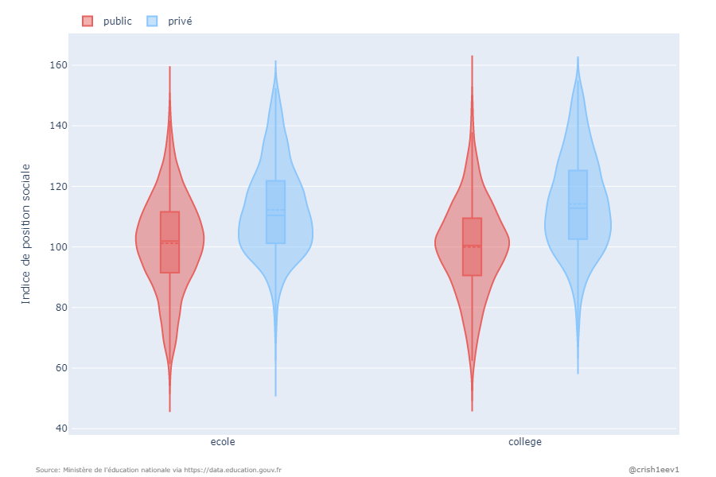
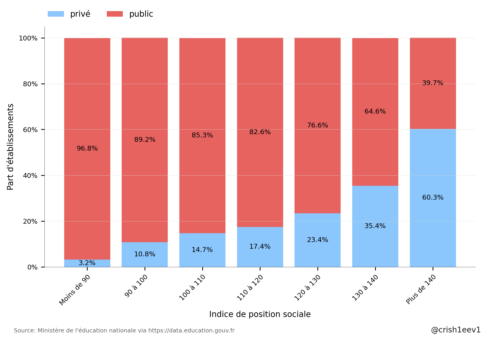
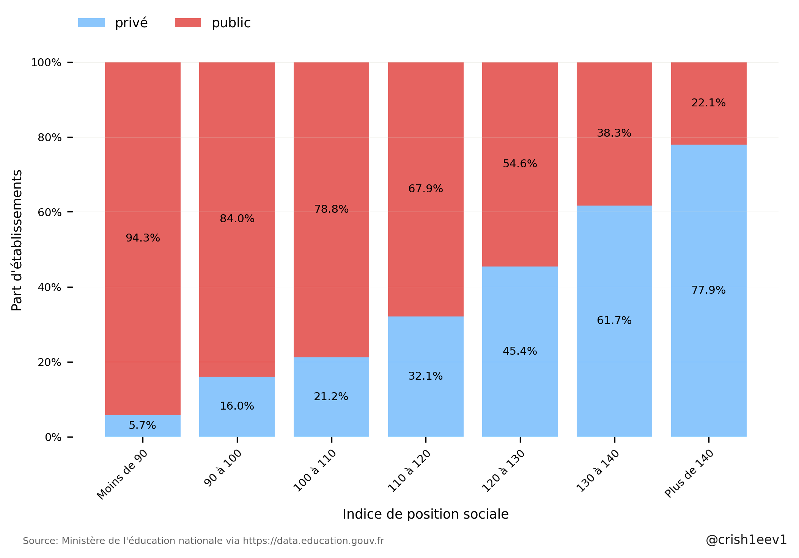
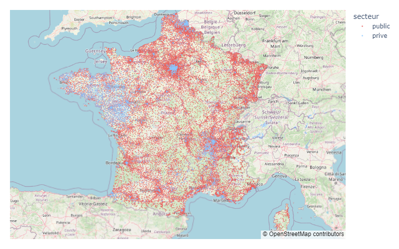
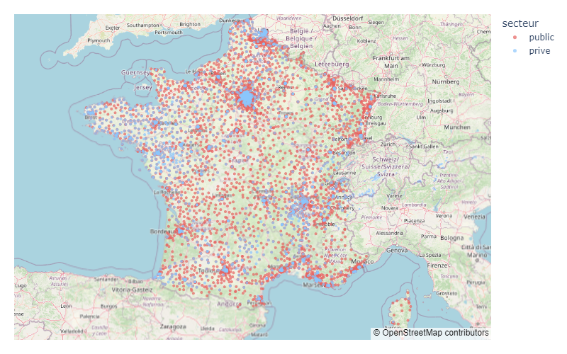
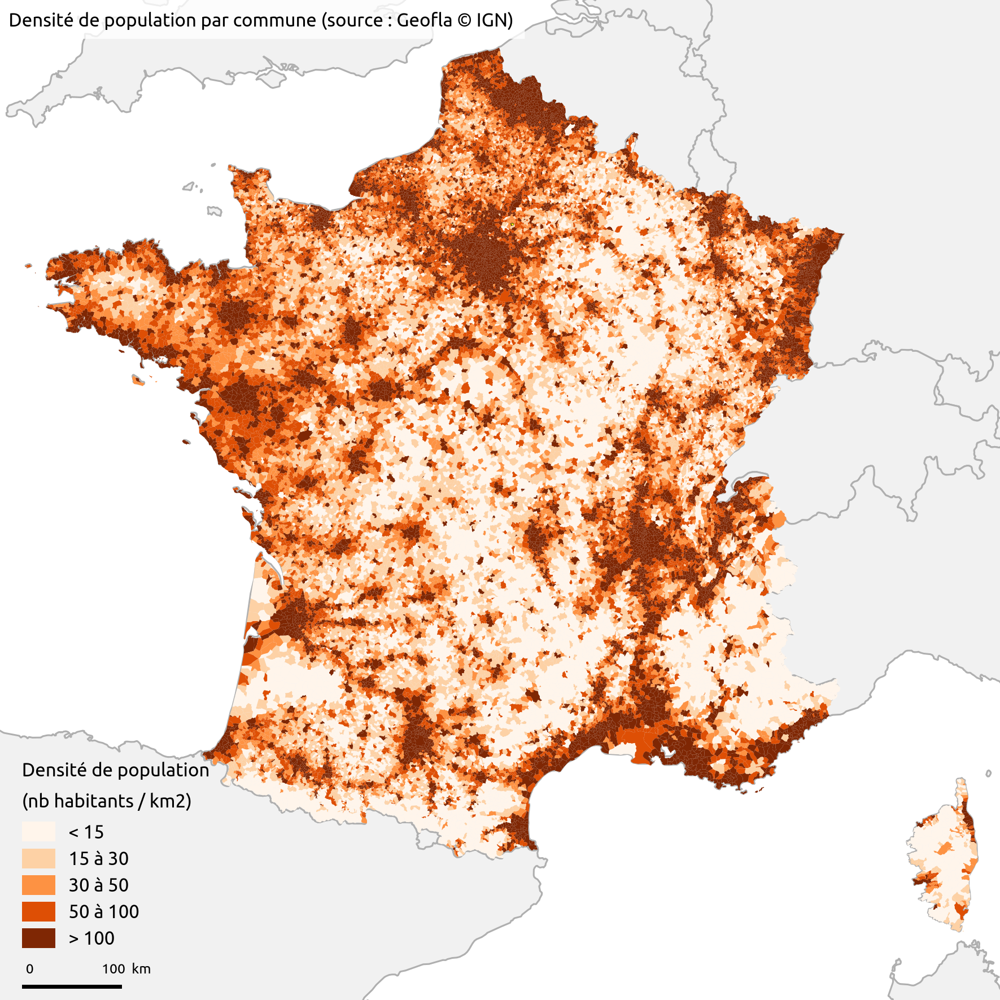

# Etude de la répartition public/privé des établissements scolaires français

## Sources

<table>
    <tr>
        <th>
DATA CONTENT & USE
</th>
        <th>
SOURCE
</th>
        <th>
INFORMATION LINK
</th>
        <th>
UPDATE
</th>
    <tr>
    <tr>
        <td>
Indices de position sociale dans les collèges de France métropolitaine et DROM  
        
</td>
        <td>
data.education.gouv.fr
</td>
        <td>
<a href="https://data.education.gouv.fr/explore/dataset/fr-en-ips_colleges/table/?disjunctive.rentree_scolaire&disjunctive.academie&disjunctive.code_du_departement&disjunctive.departement&disjunctive.uai&disjunctive.code_insee_de_la_commune&disjunctive.nom_de_la_commune&disjunctive.secteur", target="_blank">Indices de position sociale dans les collèges de France métropolitaine et DROM</a>
</td>
        <td>
October, 2022
</td>
    </tr>
    <tr>
        <td>
Indices de position sociale dans les écoles de France métropolitaine et DROM 
        
</td>
        <td>
data.education.gouv.fr
</td>
        <td>
<a href="https://data.education.gouv.fr/explore/dataset/fr-en-ips_ecoles/information/?disjunctive.academie&disjunctive.code_du_departement&disjunctive.departement&disjunctive.uai&disjunctive.code_insee_de_la_commune&disjunctive.nom_de_la_commune&disjunctive.secteur", target="_blank">Indices de position sociale dans les écoles de France métropolitaine et DROM</a>
</td>
        <td>
October, 2022
</td>
    </tr>
    <tr>
        <td>
Diplôme national du brevet par établissement 
        
</td>
        <td>
data.education.gouv.fr
</td>
        <td>
<a href="https://data.education.gouv.fr/explore/dataset/fr-en-dnb-par-etablissement/information/?disjunctive.session&disjunctive.numero_d_etablissement&disjunctive.denomination_principale&disjunctive.secteur_d_enseignement&disjunctive.commune_et_arrondissement&disjunctive.commune_et_arrondissement_lib_l&disjunctive.departement&disjunctive.departement_libelle&disjunctive.academie&disjunctive.academie_libelle&disjunctive.region&disjunctive.region_libelle", target="_blank">Diplôme national du brevet par établissement</a>
</td>
        <td>
June, 2022
</td>
    </tr>
    <tr>
        <td>
Adresse et géolocalisation des établissements d'enseignement du premier et second degrés  
        
</td>
        <td>
data.education.gouv.fr
</td>
        <td>
<a href="https://data.education.gouv.fr/explore/dataset/fr-en-adresse-et-geolocalisation-etablissements-premier-et-second-degre/table/?disjunctive.nature_uai&disjunctive.nature_uai_libe&disjunctive.code_departement&disjunctive.code_region&disjunctive.code_academie&disjunctive.secteur_prive_code_type_contrat&disjunctive.secteur_prive_libelle_type_contrat&disjunctive.code_ministere&disjunctive.libelle_ministere", target="_blank">Adresse et géolocalisation des établissements d'enseignement du premier et second degrés </a>
</td>
        <td>
October, 2022
</td>
    </tr>
        <tr>
        <td>
Revenus des Français à la commune  
        
Données extraites de la base Filosofi de l'INSEE spécifiant le niveau de vie des Français pour chaque commune française sur l'année 2013</td>
        <td>
Données extraites de la base Filosofi de l'INSEE
</td>
        <td>
<a href="https://www.data.gouv.fr/fr/datasets/revenus-des-francais-a-la-commune/", target="_blank">Revenus des Français à la commune</a>
</td>
        <td>
2014
</td>
    </tr>
</table>   

Le code permettant la collecte, la structuration et le traitement des données ainsi que la mise en forme des résultats est disponible via https://github.com/crish1eev1/public-private-distribution-french-schools
  

## 1. Répartition public/privé des écoles françaises selon l'indice de position sociale 
#### Définition de l'Indice de Position Sociale (IPS) selon wikipedia
>L'indice de position sociale des élèves (IPS) est un outil de mesure quantitatif de la situation sociale des élèves face aux apprentissages dans les établissements scolaires français. **Plus l'indice est élevé, plus l'élève évolue dans un contexte familial favorable aux apprentissages. Cet indice est construit à partir des professions et catégories socioprofessionnelles (PCS) des représentants légaux des élèves**. 
>Il est utilisé pour décrire les populations scolaires (milieu social plus ou moins favorable et mixité sociale) dans les écoles, collèges et lycées mais aussi pour classer les établissements scolaires et leur attribuer des moyens en conséquence. 
L'indice de position sociale (IPS) des élèves est un indice sans dimension compris entre 38 et 1791. Plus cet indice est élevé, plus le contexte familial de l'élève est favorable à sa réussite scolaire. 

Les données IDS sont disponibles par établissement (écoles et collèges). Dans cette section, lorsqu'on parlera d'un IDS moyen pour le public ou le privé, il faut le lire en tant que moyenne des IDS des établissements (non pondérée par le nombre d'élèves).
  

###  1.1 Distribution privé/public des écoles et collèges selon IDS (année scolaire 2021-2022)

|                    |   Nombre      |  IPS moyen |  Ecart-type |   Min       |   Max       |   Mediane   |
|--------------------|---------------|------------|-------------|-------------|-------------|-------------|
| Ecoles publiques   |         27549 |      101.2 |     15.7    |        49.6 |       155.6 |       101.9 |
| Ecoles privées     |          4542 |      112.2 |       15.1  |        56.8 |       155.4 |       110.4 |
| Collèges publics   |         5303  |      99.9  |     15.3    |        51.3 |       157.6 |       100.5 |
| Collèges privés    |          1659 |      114.2 |       16.0  |        66.0 |       154.9 |       112.8 |

On constate une distribution inégale entre établissements publics et privés avec un IPS moyen très supérieur dans le privé mais aussi des queues de distribution à l'allure inversée. En effet, les queues de distribution du public s'affinent très rapidement lorsque l'IPS augmente et inversement. Cette inégalité de répartition est plus importante pour les collèges que pour les écoles. 

Divisons les établissements scolaires en 7 groupes d'IPS afin de mieux nous rendre compte de cette distribution inégale. 
  

###  1.2 Répartition public/privé des établissments selon 7 tranches d'IDS (année scolaire 2021-2022)
#### Ecoles en pourcentage du nombre d'établissements
- Parmi les écoles avec un IPS inférieur à 90, seules 3,2% sont privées.
- Parmi celles avec un IPS supérieur à 140, 60,3% sont privées.

#### Ecoles en valeur absolue du nombre d'établissements (année scolaire 2021-2022)
|                    |   Moins de 90 |   90 à 100 |   100 à 110 |   110 à 120 |   120 à 130 |   130 à 140 |   Plus de 140 |
|--------------------|---------------|------------|-------------|-------------|-------------|-------------|---------------|
| privé sous contrat |           202 |        763 |        1256 |        1040 |         653 |         388 |           240 |
| public             |          6069 |       6276 |        7276 |        4928 |        2134 |         708 |           158 |

#### Collèges en pourcentage du nombre d'établissements (année scolaire 2021-2022)
- Parmi les collèges avec un IPS inférieur à 90, 5,7% sont privées.
- Parmi celles avec un IPS supérieur à 140, 77,9% sont privées.

#### Collèges en valeur absolue du nombre d'établissements (année scolaire 2021-2022)
|                    |   Moins de 90 |   90 à 100 |   100 à 110 |   110 à 120 |   120 à 130 |   130 à 140 |   Plus de 140 |
|--------------------|---------------|------------|-------------|-------------|-------------|-------------|---------------|
| privé sous contrat |            76 |        245 |         396 |         383 |         270 |         169 |           120 |
| public             |          1268 |       1291 |        1468 |         812 |         325 |         105 |            34 |

 

###  1.3 Répartition public/privé des établissments selon IDS par région (année scolaire 2021-2022)

## 2. Répartition géographique des établissements publics/privés

###  2.1 Répartition géographique de la métropole

#### Répartition géographique des écoles publiques/privées versus densité de population (année scolaire 2021-2022)

#### Répartition géographique des collèges publics/privés versus densité de population (année scolaire 2021-2022)

#### Densité de population en France (2019)

On constate une forte implentation des établissements privés dans les bassins de populations les plus denses alors qu'ils sont peu présents en zones rurales. Ceci à l'exception de la Bretagne et la Loire-Atlantique ou les établissements privés sont présents icompris en zones rurales. 

###  2.2 Proportion des établissements publics/privés selon la région

## 3. Brevet