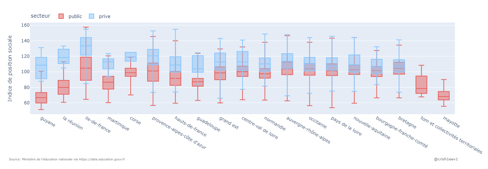
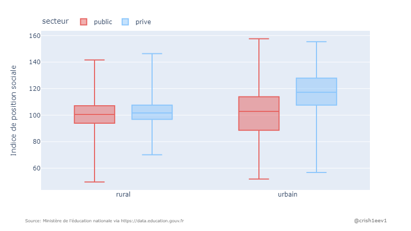

# Etude de la répartition public/privé des établissements scolaires français

## Sources

<table>
    <tr>
        <th>
TITRE
</th>
        <th>
SOURCE
</th>
        <th>
LIEN
</th>
        <th>
MAJ
</th>
    <tr>
    <tr>
        <td>
Indices de position sociale dans les collèges de France métropolitaine et DROM  
        
</td>
        <td>
data.education.gouv.fr
</td>
        <td>
<a href="https://data.education.gouv.fr/explore/dataset/fr-en-ips_colleges/table/?disjunctive.rentree_scolaire&disjunctive.academie&disjunctive.code_du_departement&disjunctive.departement&disjunctive.uai&disjunctive.code_insee_de_la_commune&disjunctive.nom_de_la_commune&disjunctive.secteur", target="_blank">Indices de position sociale dans les collèges de France métropolitaine et DROM</a>
</td>
        <td>
October, 2022
</td>
    </tr>
    <tr>
        <td>
Indices de position sociale dans les écoles de France métropolitaine et DROM 
        
</td>
        <td>
data.education.gouv.fr
</td>
        <td>
<a href="https://data.education.gouv.fr/explore/dataset/fr-en-ips_ecoles/information/?disjunctive.academie&disjunctive.code_du_departement&disjunctive.departement&disjunctive.uai&disjunctive.code_insee_de_la_commune&disjunctive.nom_de_la_commune&disjunctive.secteur", target="_blank">Indices de position sociale dans les écoles de France métropolitaine et DROM</a>
</td>
        <td>
October, 2022
</td>
    </tr>
    <tr>
        <td>
Adresse et géolocalisation des établissements d'enseignement du premier et second degrés  
        
</td>
        <td>
data.education.gouv.fr
</td>
        <td>
<a href="https://data.education.gouv.fr/explore/dataset/fr-en-adresse-et-geolocalisation-etablissements-premier-et-second-degre/table/?disjunctive.nature_uai&disjunctive.nature_uai_libe&disjunctive.code_departement&disjunctive.code_region&disjunctive.code_academie&disjunctive.secteur_prive_code_type_contrat&disjunctive.secteur_prive_libelle_type_contrat&disjunctive.code_ministere&disjunctive.libelle_ministere", target="_blank">Adresse et géolocalisation des établissements d'enseignement du premier et second degrés </a>
</td>
        <td>
October, 2022
</td>
    </tr>
    <tr>
        <td>
Typologie des communues (urbain / rural)  
        
</td>
        <td>
observatoire-des-territoires.gouv.fr
</td>
        <td>
<a href="https://www.observatoire-des-territoires.gouv.fr/typologie-urbain-rural", target="_blank">Adresse et géolocalisation des établissements d'enseignement du premier et second degrés </a>
</td>
        <td>
2021
</td>
    </tr>
    <tr>
        <td>
Diplôme national du brevet par établissement 
        
</td>
        <td>
data.education.gouv.fr
</td>
        <td>
<a href="https://data.education.gouv.fr/explore/dataset/fr-en-dnb-par-etablissement/information/?disjunctive.session&disjunctive.numero_d_etablissement&disjunctive.denomination_principale&disjunctive.secteur_d_enseignement&disjunctive.commune_et_arrondissement&disjunctive.commune_et_arrondissement_lib_l&disjunctive.departement&disjunctive.departement_libelle&disjunctive.academie&disjunctive.academie_libelle&disjunctive.region&disjunctive.region_libelle", target="_blank">Diplôme national du brevet par établissement</a>
</td>
        <td>
June, 2022
</td>
    </tr>
</table>   

Le code permettant cette analyse de données est disponible sur github:
- <a href="https://github.com/crish1eev1/public-private-distribution-french-schools/blob/main/data-processing.ipynb">Collecte et structuration des données</a>
- <a href="https://github.com/crish1eev1/public-private-distribution-french-schools/blob/main/data-analysis.ipynb">Analyse et visualisation des données</a>
  

## 1. Répartition public/privé des écoles françaises selon l'Indice de Position Sociale (IPS) 
#### Définition de l'Indice de Position Sociale selon wikipedia
>L'indice de position sociale des élèves (IPS) est un outil de mesure quantitatif de la situation sociale des élèves face aux apprentissages dans les établissements scolaires français. **Plus l'indice est élevé, plus l'élève évolue dans un contexte familial favorable aux apprentissages. Cet indice est construit à partir des professions et catégories socioprofessionnelles (PCS) des représentants légaux des élèves**. 
>Il est utilisé pour décrire les populations scolaires (milieu social plus ou moins favorable et mixité sociale) dans les écoles, collèges et lycées mais aussi pour classer les établissements scolaires et leur attribuer des moyens en conséquence. 
L'indice de position sociale (IPS) des élèves est un indice sans dimension compris entre 38 et 1791. Plus cet indice est élevé, plus le contexte familial de l'élève est favorable à sa réussite scolaire. 

Note: les jeux de données fournissent un IPS par établissement pour les écoles et les collèges. Les graphiques et tableaux de la section 1 de ce document sont établis par établissement, sans pondération par le nombre d'élèves scolarisés dans chaque établissement.
  

###  1.1 Répartition public/privé des écoles et collèges selon IPS (année scolaire 2021-2022)

 (cliquez sur l'image pour accéder à sa version dynamique) 

|                    |   Nombre      |  IPS moyen |  Ecart-type |   Min       |   Max       |   Mediane   |
|--------------------|---------------|------------|-------------|-------------|-------------|-------------|
| Ecoles publiques   |         27549 |      101.2 |     15.7    |        49.6 |       155.6 |       101.9 |
| Ecoles privées     |          4542 |      112.2 |       15.1  |        56.8 |       155.4 |       110.4 |
| Collèges publics   |         5303  |      99.9  |     15.3    |        51.3 |       157.6 |       100.5 |
| Collèges privés    |          1659 |      114.2 |       16.0  |        66.0 |       154.9 |       112.8 |

On constate une disparité importante entre établissements publics et privés avec un IPS moyen supérieur dans le privé. Visuellement, on constate aussi des queues de distribution à l'allure inversée. En effet, la queue de distribution des établissements publics s'affine rapidement lorsque l'IPS augmente tandis qu'elle reste épaisse lorsque l'IPS baisse. Et inversement pour le privé. 
  

###  1.2 Répartition public/privé des établissments selon 7 tranches d'IPS (année scolaire 2021-2022)
Dans cette sous-partie, nous diviserons les établissements scolaires en 7 groupes en fonction de leur IPS. Ceci pour les écoles puis pour les collèges.  
#### Répartition public/privé des écoles primaires selon IPS (en % du nombre d'établissements)

- Parmi les écoles avec un IPS inférieur à 90, seules 3,2% sont privées.
- Parmi celles avec un IPS supérieur à 140, 60,3% sont privées.

#### Répartition public/privé des écoles primaires selon IPS (en valeur absolue du nombre d'établissements)
|                    |   Moins de 90 |   90 à 100 |   100 à 110 |   110 à 120 |   120 à 130 |   130 à 140 |   Plus de 140 |
|--------------------|---------------|------------|-------------|-------------|-------------|-------------|---------------|
| privé sous contrat |           202 |        763 |        1256 |        1040 |         653 |         388 |           240 |
| public             |          6069 |       6276 |        7276 |        4928 |        2134 |         708 |           158 |

#### Répartition public/privé des collèges selon IPS (en % du nombre d'établissements)

- Parmi les collèges avec un IPS inférieur à 90, 5,7% sont privées.
- Parmi celles avec un IPS supérieur à 140, 77,9% sont privées.

#### Répartition public/privé des collèges selon IPS (en valeur absolue du nombre d'établissements)
|                    |   Moins de 90 |   90 à 100 |   100 à 110 |   110 à 120 |   120 à 130 |   130 à 140 |   Plus de 140 |
|--------------------|---------------|------------|-------------|-------------|-------------|-------------|---------------|
| privé sous contrat |            76 |        245 |         396 |         383 |         270 |         169 |           120 |
| public             |          1268 |       1291 |        1468 |         812 |         325 |         105 |            34 |

 

###  1.3 Répartition public/privé des établissments selon IPS par région (année scolaire 2021-2022)
Avant d'anlyser les écarts entre régions dans le détail, voici un aperçu de la répartition géographique globale en France métropolitaine. 
Cliquez sur les graphs si vous souhaitez naviguer vous même sur la carte. 

#### Répartition géographique des écoles publiques/privées (année scolaire 2021-2022)

 (cliquez sur l'image pour accéder à sa version dynamique) 

#### Répartition géographique des collèges publics/privés (année scolaire 2021-2022)

 (cliquez sur l'image pour accéder à sa version dynamique) 

On obersve une forte implantation des établissements privés dans les bassins de populations les plus denses alors qu'ils sont peu présents en zones rurales (cf <a href="https://www.populationdata.net/wp-content/uploads/2017/01/france-densite-communes.png">carte de densité de population</a> en France métropolitaine).  
La Bretagne et les Pays de la Loire constituent des exceptions à ce constat avec une présence d'établissements privés très établis, y compris en zones rurales. 

#### Distribution public/privé des écoles par région selon IPS (année scolaire 2021-2022)

 (cliquez sur l'image pour accéder à sa version dynamique) 

Ce graphique est segmenté par région en allant de celle ou l'écart d'IPS entre public et privé est le plus important (à gauche) pour finir par celle ou l'écart est le moins important (à droite, en sachant que mayotte ).
Les "boîtes" représentent le profil de chaque série statistique. Plus une boîte est longue, plus la série statistique en question comprend des valeurs dispersées. Inversement, plus la boîte est courte, plus les valeurs sont homogènes. Le trait visible à l'intérieur de chaque boîte représente la médiane de la série. 

|                                    |  Médiane IPS public |   Médiane IPS privé  |   différence |
|------------------------------------|---------------------|----------------------|--------------|
| guyane                             |               66.2  |               108.4  |        42.2  |
| la réunion                         |               76.05 |               114.45 |        38.4  |
| tom et collectivités territoriales |               78.1  |               108.35 |        30.25 |
| ile-de-france                      |              107.9  |               137.1  |        29.2  |
| martinique                         |               84.5  |               112.7  |        28.2  |
| corse                              |               98.15 |               122    |        23.85 |
| guadeloupe                         |               83.8  |               104.8  |        21    |
| hauts-de-france                    |               94.2  |               112    |        17.8  |
| provence-alpes-côte d'azur         |              103.5  |               121    |        17.5  |
| centre-val de loire                |              101.9  |               115.1  |        13.2  |
| grand est                          |              100.7  |               113.85 |        13.15 |
| bourgogne-franche-comté            |              101.9  |               109.6  |         7.7  |
| normandie                          |              100    |               107.05 |         7.05 |
| nouvelle-aquitaine                 |              102.2  |               108.8  |         6.6  |
| occitanie                          |              104.2  |               109.75 |         5.55 |
| pays de la loire                   |              101.3  |               106    |         4.7  |
| auvergne-rhône-alpes               |              106.3  |               111    |         4.7  |
| bretagne                           |              103.2  |               105.5  |         2.3  |
| mayotte                            |               67.9  |                      |              |

On constate un écart très important entre IPS dans le public et le privé dans les territoires d'outre-mer, en Ile de France, en Corse, en PACA ainsi que dans les Hauts-de-France. Des régions connues pour leur forte disparité sociale. A l'inverse, on constate un faible écart entre public et privé en Bretagne ou Pays de la Loire. Nous avons observé précédemment que ces deux régions avaient comme particularité de comporter beaucoup d'écoles privées en zones rurales, contrairement à la plupart des autres régions. Nous verrons donc dans une prochaine section comment la densité de population entre en jeu.

#### Distribution public/privé des collèges par région selon IPS (année scolaire 2021-2022)

 (cliquez sur l'image pour accéder à sa version dynamique) 

|                                    |  mediane IPS public |   mediane IPS privé  |   différence |
|------------------------------------|---------------------|----------------------|--------------|
| guyane                             |               66.7  |               108.55 |        41.85 |
| la réunion                         |               79.9  |               118.6  |        38.7  |
| ile-de-france                      |              104.7  |               133.5  |        28.8  |
| martinique                         |               86.5  |               113    |        26.5  |
| corse                              |               98.9  |               119.3  |        20.4  |
| provence-alpes-côte d'azur         |              101.1  |               120.5  |        19.4  |
| hauts-de-france                    |               91.5  |               108.85 |        17.35 |
| guadeloupe                         |               87.1  |               103.9  |        16.8  |
| grand est                          |               98.6  |               112.7  |        14.1  |
| centre-val de loire                |              100.1  |               112.85 |        12.75 |
| normandie                          |               97.4  |               110.1  |        12.7  |
| auvergne-rhône-alpes               |              104    |               113.5  |         9.5  |
| occitanie                          |              103.8  |               110.55 |         6.75 |
| pays de la loire                   |              101.25 |               107.7  |         6.45 |
| nouvelle-aquitaine                 |              102.6  |               109    |         6.4  |
| bourgogne-franche-comté            |              101.4  |               106.5  |         5.1  |
| bretagne                           |              104.3  |               107.15 |         2.85 |
| tom et collectivités territoriales |               78.6  |                      |              |
| mayotte                            |               68.15 |                      |              |

On retrouve presque le même classement pour les collèges.

###  1.4 Répartition public/privé des établissments selon IPS par densité de population (année scolaire 2021-2022)

Nous avons observé (visuellement) que les établissements privés étaient davantage concentrés dans les agglomérations, à l'exception notable de la Bretagne et des Pays de la Loire.
Nous avons aussi constaté que ces deux régions font partie de celles où l'écart d’IPS entre public et privé est le plus faible. Il semble donc intéressant de segmenter nos observations selon la densité de la commune de l'établissement observé. De cette manière, nous pourrons déterminer si le faible écart d'IPS dans ces deux régions constitue une exception régionale ou si l'écart est généralement plus faible en zone rurale et que ce facteur influe de manière plus importante sur ces régions de par la présence importante des établissements privés en zones rurales.
 
La segmentation écoles/collèges n’ayant révélé que peu de différences jusqu’à présent, nous regrouperons cette fois les écoles et collèges afin de maximiser le nombre d’observations par région. 

#### Distribution public/privé des établissements selon densité de population (année scolaire 2021-2022)

 (cliquez sur l'image pour accéder à sa version dynamique) 

#### Distribution public/privé des établissements en zone rurale par région (année scolaire 2021-2022)
